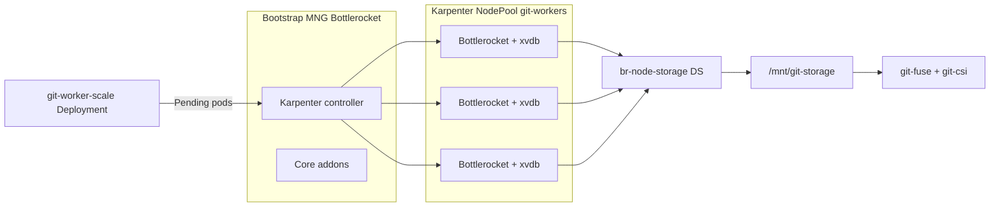

# Karpenter + Bottlerocket + extra EBS lab (ADR-002 workplace reference)

## Why this lab

The managed-node-group Bottlerocket lab (`docs/BOTTLEROCKET-LAB.md`) proved the architecture on static nodes.
Workplace uses **Karpenter** to provision Bottlerocket workers with an **extra block device** for Git cache/FUSE.

This lab is the closest in-repo reference for that shape:

| Piece | Workplace analogue | This repo |
|---|---|---|
| Provisioner | Karpenter `NodePool` + `EC2NodeClass` | `eks/karpenter/` |
| OS | Bottlerocket | `amiFamily: Bottlerocket` |
| Extra disk | `blockDeviceMappings` `/dev/xvdb` | 40 Gi gp3 (explicit **xvda + xvdb**) |
| Host mount | Privileged bootstrap → `/mnt/git-storage` | `eks/br-node-storage.yaml` (UBI9) |
| FUSE | DirectMountStrict, static busybox | `fuse-csi/` (unchanged) |
| Reconciler image | UBI9-based | `reconciler/Dockerfile.ubi9` |

## Critical Karpenter detail (extra EBS)

If you specify **any** `blockDeviceMappings` on a Bottlerocket `EC2NodeClass`, Karpenter does **not** merge defaults.
You must define **both**:

- `/dev/xvda` — control volume (kubelet/containerd)
- `/dev/xvdb` — data volume (extra Git disk; maps to `nvme1n1` on Nitro)

Omitting `xvda` can yield a 2 Gi root volume ([karpenter-provider-aws#8747](https://github.com/aws/karpenter-provider-aws/issues/8747)).

## Architecture



Bootstrap nodes are labeled `adr002.io/role=system`. Git workloads and DaemonSets use `adr002.io/role=git-worker` so storage/FUSE only run on Karpenter nodes.

## Runbook

Run from the `test/` directory (see [`test/README.md`](../README.md)):

```bash
cd test
# 1. Cluster + Karpenter + 3 git-worker nodes (20–30+ min first time)
./scripts/eks-karpenter-up.sh

# 2. Build/push images — reconciler on UBI9, tag for this lab
USE_UBI9=1 IMAGE_TAG=eks-karpenter ./scripts/eks-push-images.sh

# 3. FUSE gate (cheap fail-fast)
./scripts/run-eks-karpenter-probe.sh

# 4. Full multi-node quest (only if probe passes)
CLUSTER=adr002-git-csi-karpenter ./scripts/run-eks-test.sh

# 5. Tear down
./scripts/eks-karpenter-down.sh
```

Do **not** apply `eks/install-fuse.yaml` — Bottlerocket has no host `dnf`.

## Key files

| Path | Purpose |
|---|---|
| `eks/cluster-karpenter.yaml` | eksctl: EKS 1.35, Karpenter 1.9, Bottlerocket bootstrap MNG |
| `eks/karpenter/ec2nodeclass-git-workers.yaml.in` | Extra EBS + BR admin container |
| `eks/karpenter/nodepool-git-workers.yaml` | `m5.large` on-demand git workers |
| `eks/karpenter/scale-git-workers.yaml` | Anti-affinity hold pods → 3 nodes |
| `eks/br-node-storage.yaml` | UBI9 privileged disk bootstrap |
| `reconciler/Dockerfile.ubi9` | UBI9 reconciler (workplace-aligned) |
| `scripts/eks-karpenter-*.sh` | Up / down / render |

Render EC2NodeClass with your cluster name:

```bash
CLUSTER=adr002-git-csi-karpenter ./scripts/eks-karpenter-render.sh
```

## Workplace mapping

Copy/adapt these into your Helm values or GitOps repo:

1. **EC2NodeClass** — mirror `blockDeviceMappings` (both devices), subnet/SG discovery tags, Bottlerocket `userData` for admin if needed.
2. **NodePool** — instance types, labels (`adr002.io/role=git-worker`), consolidation policy (replacing a node = FUSE remount event).
3. **br-node-storage** — DaemonSet with `nodeSelector: adr002.io/role: git-worker`, privileged + Bidirectional `/mnt`.
4. **Gate before full rollout** — `run-eks-karpenter-probe.sh` or equivalent `PROBE_OK` check per node.

## Troubleshooting

```bash
# Karpenter provisioning
kubectl get nodepools,nodeclaims,ec2nodeclasses
kubectl -n kube-system logs -l app.kubernetes.io/name=karpenter --tail=100

# Extra disk on a worker
kubectl -n adr001-system logs -l app=br-node-storage --tail=50

# FUSE gate
kubectl -n adr001-system logs -l app=br-fuse-probe --tail=80
```

If git-worker nodes never appear: confirm `metadata.tags.karpenter.sh/discovery` on the cluster matches `EC2NodeClass` subnet/SG selectors, and that pending pods have `nodeSelector: adr002.io/role: git-worker`.

## Findings

Record results in `docs/KARPENTER-FINDINGS.md` after a run (create when probe/quest complete).
