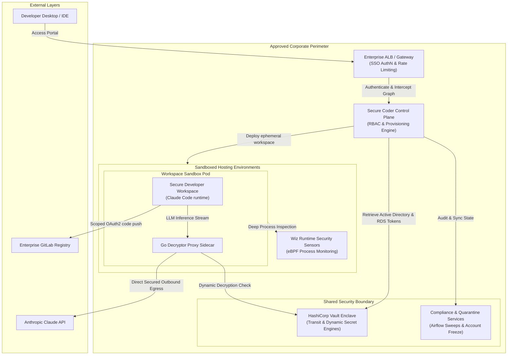
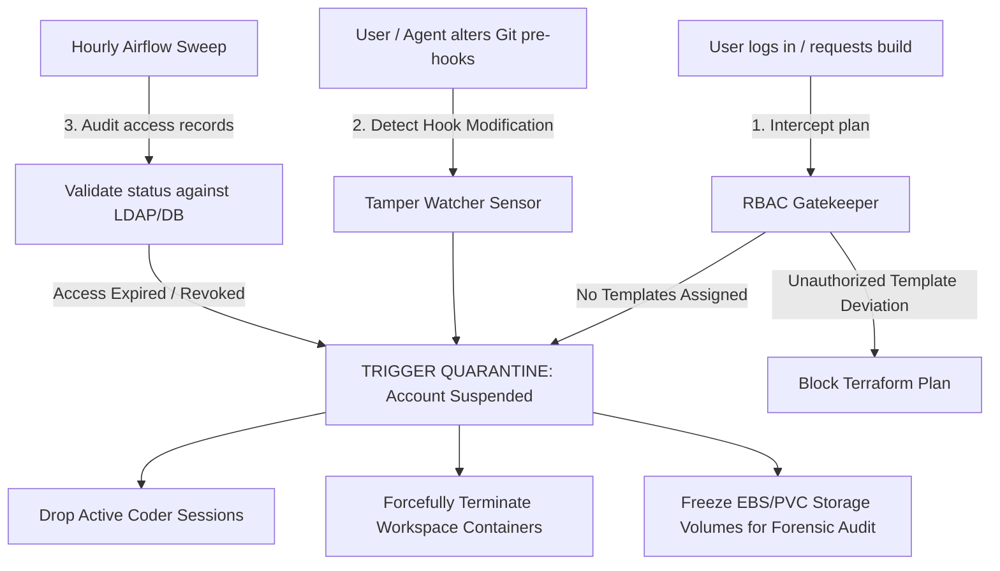
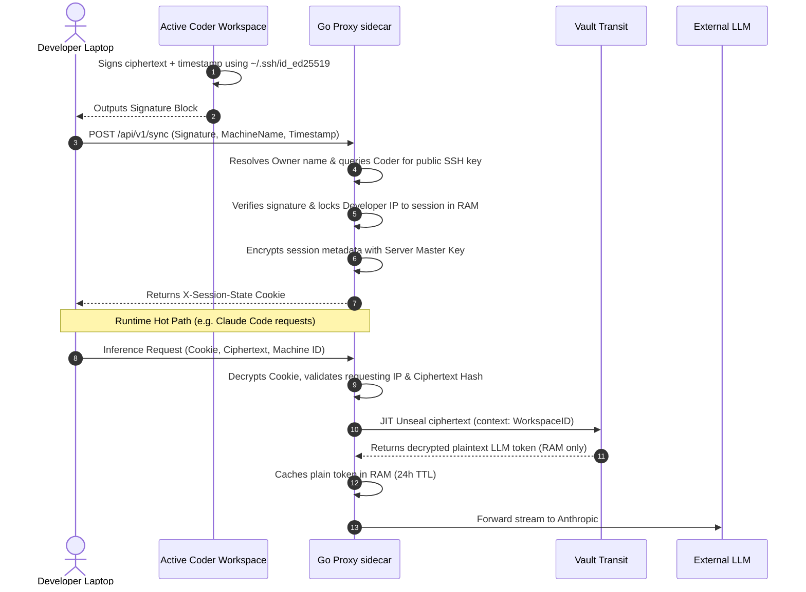

# Secure Coder Technical Architecture & Security Dossier

## Executive Summary

Deploying agentic AI assistants (such as Claude Code) on traditional corporate laptops introduces an unpredictable, unmanageable risk profile. If an AI agent executes a malicious payload or succumbs to an indirect prompt injection attack locally, it does so with access to local keys, corporate VPN networks, and unmonitored file systems.

**Secure Coder neutralizes this threat model by design.** By moving development into an ephemeral, containerized sandbox, Secure Coder decouples identity, filesystem state, and LLM orchestration. Security is shifted entirely out of the user's control and embedded into the managed infrastructure layer, rendering the platform resilient to rogue code execution, token theft, supply-chain poisoning, and data exfiltration.

---

## 1. End-to-End System Architecture

The following diagram illustrates the complete data flow, identity validation, and cryptographic loop of the Secure Coder platform. It highlights how the platform seamlessly runs against pre-approved corporate infrastructure patterns without introducing any shadow IT footprint.

---

## 2. Deep-Dive Security Posture & Engineering Guardrails

### Layer 1: Zero-Static-Password Infrastructure Patterns

Secure Coder relies purely on pre-approved corporate enterprise infrastructure patterns. It introduces **no footprint drift, custom database layers, or perimeter network modifications** to the wider corporate environment.

* **LDAP Secrets Engine:** Instead of hardcoding domain service account credentials to handle user directory lookups, Coder interfaces with Vault's LDAP Secrets Engine. Vault rotates the Active Directory system account password monthly to a randomly generated, high-entropy string.
* **Database Secrets Engine:** The Coder control plane metadata database (AWS RDS PostgreSQL) is completely devoid of static passwords. Vault dynamically provisions short-lived database credentials that are rotated automatically on a monthly schedule.

### Layer 2: Custom Coder Open Source RBAC & Proactive Suspension

Because the Open Source version of Coder does not natively evaluate granular OIDC authorization claims at the template level, we engineered a custom **RBAC Gatekeeper Module** directly into Coder's provisioning pipeline. Since Coder leverages Terraform for the workspace state graph, our gatekeeper intercepts the plan layer before any resource is created:

* **The Zero-Template Lockout (Global Suspension):** If a user successfully logs in via PingFederate but has zero assigned templates in the access matrix, the custom RBAC gatekeeper immediately **suspends the user account** within the platform, invalidating their session and blocking future entry.
* **The Template Deviation Block:** If an authorized user attempts to bypass the UI to build a workspace from an unauthorized template, the custom RBAC module intercepts the compilation graph, throws a policy error, and instantly kills the Terraform plan, preventing compute allocation.
* **Hourly Airflow Sweeps:** To catch access modifications or user deprecations after authentication, an Apache Airflow scheduler triggers automated compliance runs every single hour to ensure active state validation.

### Layer 3: Immutable Operating Systems & Kernel Hardening

If a developer or a rogue agentic script attempts a privilege escalation or host container breakout, they run into a heavily hardened OS barrier:

* **Immutable Compute Hosts:** Workspaces are deployed onto fully stripped-down, container-optimized operating systems—**Bottlerocket OS** on AWS EKS nodes or **Red Hat Enterprise Linux CoreOS (RHCOS)** on OpenShift. These operating systems utilize read-only root filesystems and completely omit package managers, python, or traditional shells.
* **Syscall Filtering (Seccomp):** Pods run strictly under the **Kubernetes Restricted V2 Pod Security Standards (PSS)** profile combined with rigorous **Seccomp** filters. System calls are explicitly constrained at the kernel layer, stripping away the capabilities required to interact with host-level resources.

### Layer 4: Automated Evergreening & Storage Isolation

* **Stateless Compute Execution:** Secure Coder separates compute from state. Workspaces are completely ephemeral; upon every manual restart, automated stop, or lifecycle timeout, the container compute layer is entirely destroyed. A pristine container built from the latest, fully patched master image is deployed in its place.
* **Bloat Isolation:** Persistent user state is strictly isolated to a single volume mount at `/home/coder`. Any configuration drift, untrusted caching, or malicious binaries written to filesystem roots outside this specific path are wiped clean during the recycle phase.
* **Wiz Hybrid Defense Matrix:** On AWS, **Wiz** takes agentless snapshots of underlying EBS storage blocks out-of-band to scan `/home/coder` for malicious payloads. Concurrently, a **Wiz Kubernetes Runtime Sensor** runs live on the workspace namespace, utilizing eBPF to monitor active processes inside the running container for real-time threat detection.

### Layer 5: The Vault Transit Token Moat (Path B & Path C)

To maintain non-repudiation and prevent developers from copying high-privilege corporate Anthropic tokens to local devices, Secure Coder uses **HashiCorp Vault’s Transit Secrets Engine**. API keys never exist as plaintext in application environments.

* **Cryptographic Decoupling:** The master private key remains sealed within Vault. Coder handles the token exclusively as an opaque, non-exportable ciphertext (`vault:v1:...`).
* **Path B (In-Sandbox Flow):** When Claude Code executes inside the container sandbox, it reads only the ciphertext. When an inference request is fired, a local, root-managed **Go Proxy sidecar** intercepts the stream. The Go Proxy passes the ciphertext to Vault along with its authenticated Kubernetes Service Account token to decrypt the stream out-of-band. The raw key is never exposed to the container environment or system logs.
* **Path C (Secure Local Laptop Breakout):** For localized visualization suites (e.g., Tableau) or desktop analytics tools (like `claude-code`) that cannot be containerized inside a Secure Coder workspace:
  * The developer generates an out-of-band cryptographic signature of their ciphertext and timestamp using their workspace private SSH key.
  * A lightweight local utility (`sync-ip.exe`) registers the signature and machine hostname with the Go Proxy to dynamically anchor the developer's laptop network IP.
  * Upon verification, the proxy issues a server-side encrypted, stateless session cookie (`X-Session-State`) to the laptop client.
  * During runtime, requests must pass this cookie and match the locked client IP and ciphertext hash. If valid, the Go Proxy performs a JIT unseal with Vault Transit.
  * Stolen ciphertexts are completely inert as they cannot be decrypted without a valid dynamic IP match and cryptographic signature proof from the workspace.

### Layer 6: Tamper-Proof Managed Hooks & Repository Provenance

Secure Coder implements strict control logic that is fundamentally impossible to replicate or enforce on a standard corporate laptop:

* **Root-Owned ConfigMap Hardening:** The system configurations, routing tables, and behavioral boundaries for the Claude agent are injected via a Kubernetes ConfigMap. This mount is marked as read-only (`0444`) and is owned exclusively by `root`. Because the workspace and AI agent execute under restricted, non-root user IDs, they cannot alter or bypass these settings.
* **Repository Provenance Interdiction Hook:** Managed infrastructure settings inject a pre-execution hook that validates the remote metadata of any Git repository the agent attempts to interact with. If a developer attempts to clone or process an unvetted public fork or a blacklisted repository, the hook intercepts the operation, blocks the action, and **instantly disables the Claude agent engine**.
* **Git Pre-Hook Quarantine Trigger:** Secure Coder forces mandatory Git pre-hooks (for secrets scanning, code quality, and branch compliance). If a developer or a rogue script attempts to tamper with, comment out, or delete these security pre-hooks, an internal watcher triggers the **Platform Quarantine Protocol**: the user's account is instantly suspended globally, active workspace containers are forcefully terminated, and the underlying storage state is frozen strictly for SecOps forensic investigation.
* **Pure OAuth2 Authentication:** The platform eliminates the use of long-lived Personal Access Tokens (PATs) or static SSH keys inside `~/.ssh`. All git operations are authenticated via short-lived, scoped OAuth2 tokens generated dynamically during the Coder-GitLab handshake.

---

## 3. The Definitive Moat: Secure Coder Sandbox vs. Corporate Laptop

To summarize the platform's posture for security approval, this table outlines why running agentic AI workflows within the Secure Coder sandbox eliminates the threat vectors that make laptop deployment unviable:

| Security Vector | The Corporate Laptop Threat Profile | The Secure Coder Managed Sandbox Posture |
| --- | --- | --- |
| **Identity & Git Access** | Long-lived SSH keys and plaintext GitLab PATs sit unencrypted in local user profiles, highly vulnerable to scraping. | **Pure OAuth2 Exchange:** No static keys are used. Tokens are short-lived, scoped, and generated dynamically during login handshakes. |
| **LLM Key Protection** | Plaintext API keys can be easily copied locally, leaked in terminal output, or harvested from environment states. | **Decoupled Vault Transit:** Keys exist only as ciphertexts. Inline decryption and routing are handled out-of-band by the Go Proxy sidecar. |
| **Infrastructure Secrets** | Static configuration passwords linger in files. High risk of leakages across distributed development environments. | **Dynamic Secrets Engines:** Zero static passwords. Core connections to Active Directory and RDS rotate monthly via Vault. |
| **Patching & Drift** | Vulnerable to patching fatigue, user-postponed updates, local administration overrides, and software bloat. | **Automated Evergreening:** Compute layer is entirely stateless. Every cycle destroys the container and deploys a pristine, fully patched master image. |
| **Supply Chain Defense** | **Blind Execution:** Local tools read any unvetted codebase or zip file. No native capability to block AI based on repository origin. | **Managed Provenance Hooks:** Root-owned verification hooks evaluate repository domains; if a repo is blacklisted, Claude is blocked instantly. |
| **Tamper Resistance** | Developers possess local admin privileges, allowing them to easily bypass, disable, or delete local security Git hooks. | **Automated Quarantine:** Tampering with mandated Git pre-hooks triggers immediate account suspension and freezes storage for forensic audit. |
| **Network Perimeter** | Exposed to local networks (home Wi-Fi, public hotspots) with unconstrained, difficult-to-filter outbound egress. | **Default-Deny Topologies:** Zero direct inbound routing. Live eBPF behavioral monitoring via Wiz Runtime Sensors and strict egress whitelisting. |

---

## Conclusion

The Secure Coder architecture addresses and closes every major risk vector associated with enterprise AI onboarding. By abstracting the toolchain from the hardware and wrapping execution in a zero-trust cryptographic matrix, Secure Coder successfully shifts security from an endpoint compliance headache into a deterministic infrastructure guarantee. It stands as the definitive, safe gateway for consuming Claude Code across the enterprise.